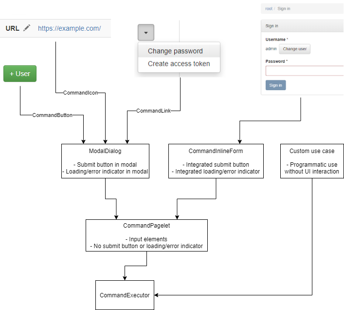

Reusable but very modest UI toolkit based on React + TypeScript + Bootstrap.

Also includes things related to task-based UIs (command pattern).

Use examples
------------

See any of these projects:

- [function61/varasto](https://github.com/function61/varasto)
- [function61/pi-security-module](https://github.com/function61/pi-security-module)

Docs
----

### Hierarchy of command UI components

